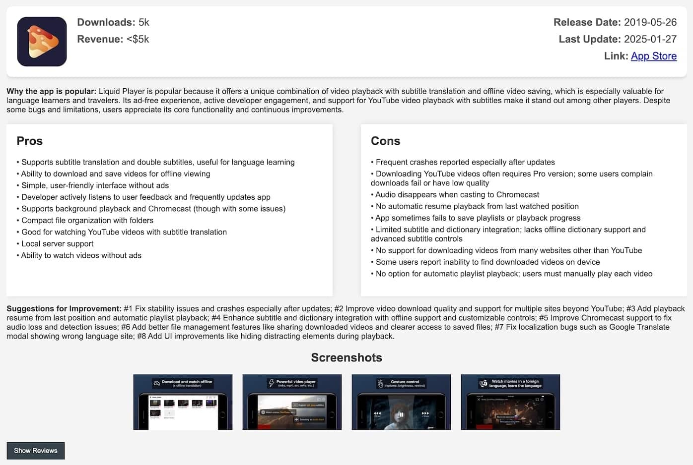

## Python App Review Analyzer

A powerful tool to analyze user reviews from both iOS App Store and Google Play Store using GPT.

### Features:
- **Multi-platform support**: iOS App Store and Google Play Store
- **AI-powered analysis**: Uses OpenAI GPT models to analyze reviews
- **Comprehensive insights**: Identifies pros, cons, improvement suggestions, and popularity factors
- **Beautiful HTML reports**: Generates detailed HTML reports with review data
- **Multi-store support**: Collects reviews from multiple countries/stores

### Installation:
```bash
pip install -r requirements.txt
```

### Usage:

#### iOS Apps:
```bash
python3 review_analyzer.py \
  --gpt_model=gpt-4o-2024-05-13 \
  --gpt_api_key=sk-DfS... \
  --app_ids=1448868559 \
  --platform=ios
```

#### Android Apps:
```bash
python3 review_analyzer.py \
  --gpt_model=gpt-4o-2024-05-13 \
  --gpt_api_key=sk-DfS... \
  --app_ids=com.whatsapp \
  --platform=android
```

#### Multiple Apps:
```bash
python3 review_analyzer.py \
  --gpt_model=gpt-4o-2024-05-13 \
  --gpt_api_key=sk-DfS... \
  --app_ids=1448868559,com.whatsapp \
  --platform=ios
```

### Parameters:
- `--gpt_api_key`: Your OpenAI API key (required)
- `--gpt_model`: GPT model to use (default: gpt-4o-mini-2024-07-18)
- `--app_ids`: Comma-separated list of app IDs (required)
- `--platform`: Platform to analyze - 'ios' or 'android' (default: ios)
- `--stores`: Comma-separated list of countries/stores (default: us,ca,au,ru,it,in,fr,gb,ua,jp,cn,tw,my,de,kr,br,mx,es,sa,ae,vn,tr)
- `--save_folder`: Directory to save HTML reports (default: ./temp)

### App ID Formats:
- **iOS**: Numeric ID (e.g., 1448868559)
- **Android**: Package name (e.g., com.whatsapp)

### Example Output:


### Dependencies:
- openai
- tiktoken
- tqdm
- requests
- google-play-scraper
